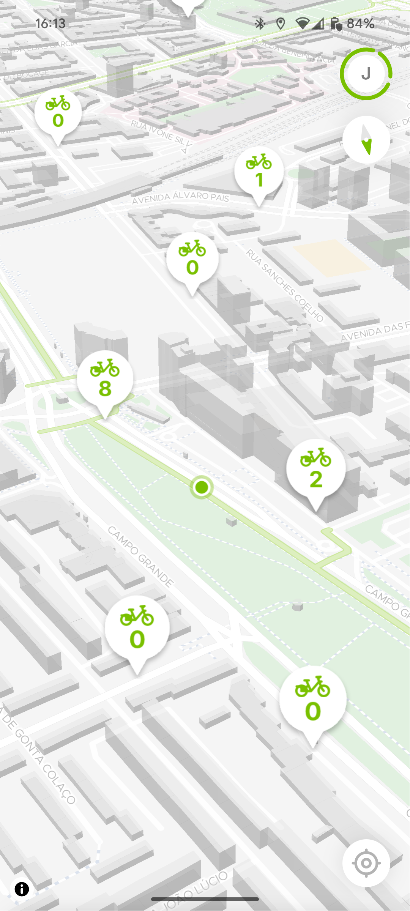
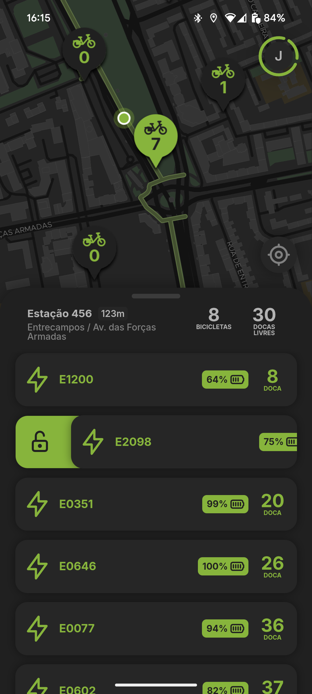
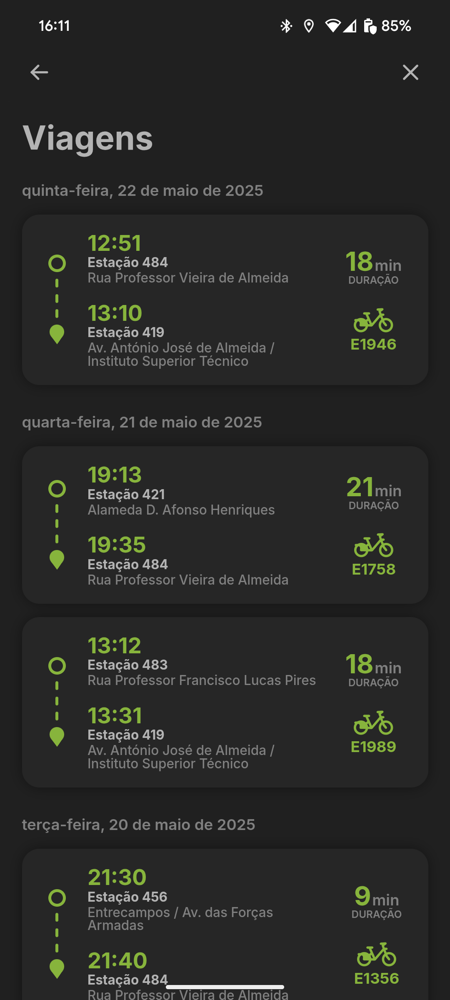

<p align="center">
  
</p>

# Gira+
**Gira+** é uma re-implementação da aplicação Gira da Câmara Municipal de Lisboa/EMEL.
Com um olhar atento ao design, à experiência do utilizador (UX) e à estabilidade, este projeto visa proporcionar uma experiência de utilização mais agradável ao sistema de bicicletas partilhadas de Lisboa.

<p align="center">
  
  
  
  
</p>

### Funcionalidades extra
- Mapa com ciclovias
- Cálculo da distância percorrida e velocidade média durante uma viagem

### Não implementado
- Criação de contas
- Carregamento de saldo
- Compra de passes
- Histórico de passes e carregamentos
- Submissão de descrição na avaliação de viagem

### Desenvolvimento
A aplicação está a ser desenvolvida em **SvelteKit**, juntamente com a biblioteca **Capacitor** para compilar para Android.

## Instalação e Compilação

### Android
É possível descarregar a versão mais recente da aplicação [aqui](https://github.com/rt-evil-inc/gira/releases/latest).

A aplicação irá ser disponibilizada na PlayStore. Aguardamos validação da Google.

Alternativamente, a aplicação pode ser compilada através dos seguintes passos:

1. Preparação:
 - Garantir que o Android SDK está instalado.
2. Configuração:
```bash
git clone git@github.com:rt-evil-inc/gira.git
cd gira
```
 - Criar um ficheiro `android/local.properties` com o caminho para o Android SDK, como no exemplo:
```properties
sdk.dir=/opt/android-sdk/
```
3. Compilação:
```sh
npm install
npm run build-app
```
  ou
```sh
bun install
bun run build-app
```

O ficheiro .apk será criado em `android/app/build/outputs/apk/debug/app-debug.apk`

### iOS

A aplicação irá ser disponibilizada na App Store.

De momento, a aplicação pode ser compilada através dos seguintes passos:

1. Preparação:
 - Garantir que o Xcode está instalado.
 - Instalar Cocoapods, caso necessário: `brew install cocoapods`
2. Configuração:
```sh
git clone git@github.com:rt-evil-inc/gira.git
cd gira
```
3. Compilação:
```sh
npm install
npm run build
npx cap run ios
```
  ou
```bash
bun install
bun run build
bunx cap run ios
```

## Misc
Cumprimentos ao [@afonsosousah](https://github.com/afonsosousah), que inspirou o projeto com o [mGira](https://github.com/afonsosousah/mgira).  
Obrigado ao [@joaodcp](https://github.com/joaodcp), que ajudou com esforços de reverse engineering do sistema original.  
Agradecimentos à Inês Freitas pelo design do logo da aplicação.